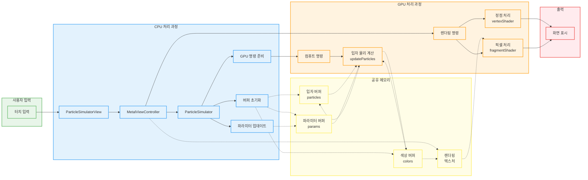

## Particle Simulator on GPU Architecture 

```mermaid
flowchart LR
    subgraph Input["사용자 입력"]
        Touch[터치 입력]
    end
    
    subgraph CPUProcess["CPU 처리 과정"]
        direction TB
        View[ParticleSimulatorView]
        Controller[MetalViewController]
        SimLogic[ParticleSimulator]
        InitBuffers[버퍼 초기화]
        UpdateParams[파라미터 업데이트]
        PrepareCommands[GPU 명령 준비]
    end
    
    subgraph SharedMem["공유 메모리"]
        direction TB
        PBuf[입자 버퍼<br/>particles]
        CBuf[색상 버퍼<br/>colors]
        ParamBuf[파라미터 버퍼<br/>params]
        Texture[렌더링<br/>텍스처]
    end
    
    subgraph GPUProcess["GPU 처리 과정"]
        direction TB
        ComputeCmd[컴퓨트 명령]
        PhysicsCalc[입자 물리 계산<br/>updateParticles]
        RenderCmd[렌더링 명령]
        VertexProc[정점 처리<br/>vertexShader]
        FragProc[픽셀 처리<br/>fragmentShader]
    end
    
    subgraph Output["출력"]
        Display[화면 표시]
    end
    
    %% 입력 연결
    Touch --> View
    
    %% CPU 내부 연결
    View --> Controller
    Controller --> SimLogic
    SimLogic --> InitBuffers
    SimLogic --> UpdateParams
    SimLogic --> PrepareCommands
    
    %% CPU - 공유 메모리 연결
    InitBuffers -.-> PBuf
    InitBuffers -.-> CBuf
    InitBuffers -.-> ParamBuf
    UpdateParams -.-> ParamBuf
    Controller -.-> Texture
    
    %% 공유 메모리 - GPU 연결
    PBuf -.-> PhysicsCalc
    CBuf -.-> PhysicsCalc
    ParamBuf -.-> PhysicsCalc
    PhysicsCalc -.-> PBuf
    PhysicsCalc -.-> CBuf
    CBuf -.-> Texture
    Texture -.-> FragProc
    
    %% CPU - GPU 명령 연결
    PrepareCommands --> ComputeCmd
    Controller --> RenderCmd
    
    %% GPU 내부 연결
    ComputeCmd --> PhysicsCalc
    RenderCmd --> VertexProc
    RenderCmd --> FragProc
    VertexProc --> Display
    FragProc --> Display
    
    %% 스타일 정의
    classDef inputStyle fill:#e8f5e9,stroke:#66bb6a,stroke-width:2px
    classDef outputStyle fill:#ffebee,stroke:#ef5350,stroke-width:2px
    classDef cpuStyle fill:#e3f2fd,stroke:#42a5f5,stroke-width:2px
    classDef memStyle fill:#fffde7,stroke:#ffee58,stroke-width:2px
    classDef gpuStyle fill:#fff3e0,stroke:#ffa726,stroke-width:2px
    
    %% 스타일 적용
    class Touch,Input inputStyle
    class View,Controller,SimLogic,InitBuffers,UpdateParams,PrepareCommands,CPUProcess cpuStyle
    class PBuf,CBuf,ParamBuf,Texture,SharedMem memStyle
    class ComputeCmd,PhysicsCalc,RenderCmd,VertexProc,FragProc,GPUProcess gpuStyle
    class Display,Output outputStyle
```
